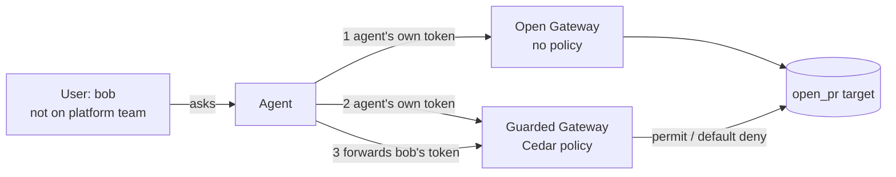

# The agent should act as the user who asked

A runnable demo of the confused-deputy problem for tool-using agents on Amazon Bedrock AgentCore, and of what
AgentCore Gateway Policy (Cedar) does and does not fix. Everything runs against a mock target: no GitHub token,
no real repository, nothing you can hurt.

It answers two open questions on AWS re:Post:
[how do you keep an agent from acting beyond the permissions of the user who asked?](https://repost.aws/questions/QUiHdLIIqyTveYH7Dmkm-trg)
and [multi-tenant calls with each tenant's own JWTs](https://repost.aws/questions/QUyDHzReMZRbG-vb0g1XvepQ).

## The idea in one diagram

## What it shows

| # | Case | Result |
|---|------|--------|
| 1 | Agent uses its own credential, no policy | PR opened for bob on `platform-infra` |
| 2 | Agent uses its own credential, policy attached | **Still opened.** The policy sees the agent, not bob |
| 3 | Agent forwards bob's token, policy attached | Denied; target never invoked |
| 3 | Same, alice (platform team) | Allowed for `platform-infra`; denied for `payments` (no permit) |
| 3b | bob in `platform-readonly`, carol in `platform` + `oncall` | Exact-element match: bob denied, carol allowed |
| 4 | bob removed from the team, old token still valid | **Allowed.** Cedar only knows what the token says |

The lesson from cases 1 and 2: a policy does nothing if the user's identity never reaches the Gateway.
Case 4 is the limit: Gateway Policy decides on the JWT claims and the tool arguments only. It cannot ask
GitHub or Kubernetes whether the person still has access right now. Closing that gap takes short token
lifetimes, revocation, and a live check in the tool for anything high risk.

## A sharp edge I hit

The `cognito:groups` claim reaches Cedar as a string that looks like `["platform","oncall"]`. My first policy
used `like "*platform*"`, which also matched a `platform-readonly` group and let bob through. The fix is to
match the quoted element: `like "*\"platform\"*"`. Both behaviours are in the transcript, tested.

## Run it

Needs an AWS account with CDK bootstrapped in us-east-1, Node 20+, Python 3.10+ with boto3.

    make deploy    # about 2 minutes: Cognito, Lambda, DynamoDB, two Gateways, a policy engine, two policies
    make demo      # runs the cases and prints PASS/FAIL per case (transcript in docs/transcript.txt)
    make destroy   # removes everything

The "agent" is a deterministic script standing in for whatever the model decides to call. That is deliberate:
enforcement must not depend on the model's decisions, so the model is out of the loop. The demo users and
password are throwaway and live only in the demo user pool.

## Cost

Published rates: Gateway $5 per million invocations, Policy $25 per million authorisations
([pricing](https://aws.amazon.com/bedrock/agentcore/pricing/)). One full demo run makes ten tool calls, so the
AgentCore side is well under one cent. The small Cognito, DynamoDB and Lambda charges around it are not priced
here. This is an estimate from list prices, not a measured bill.

## Not in scope

Not a production reference architecture. Real downstream authorisation, temporal (session) policies, and the
model-in-the-loop version are out of scope. The service agent user stands in for a machine credential; Cognito
machine-to-machine tokens carry no group claim, so a real deployment would model the agent identity differently.
